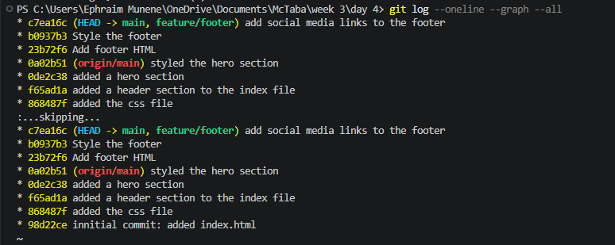

Git Branching & Merging Exercise
This repository demonstrates a basic Git workflow with branching and merging.
Exercise Overview
✅ Initialized a new repository
✅ Made 5 commits on `main` branch
✅ Created `feature/footer` branch
✅ Made 3 commits on the feature branch
✅ Merged `feature/footer` back into `main`
Commit History
Commit	Description	Branch
1	Add index.html with basic structure	`main`
2	Add styles.css with body styles	`main`
3	Add a header section to HTML	`main`
4	Add a hero section to HTML	`main`
5	Style the header and hero in CSS	`main`
6	Add footer HTML	`feature/footer`
7	Style the footer	`feature/footer`
8	Add social media links to footer	`feature/footer`
Git Log Screenshot
Paste your screenshot below:

---
Exercise completed on June 9, 2026